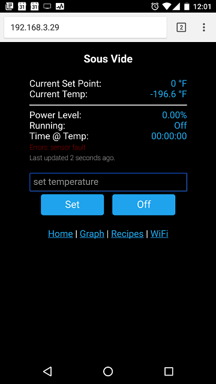

	# wifi-sous-vide

- [wifi-sous-vide](#wifi-sous-vide)
- [About](#about)
	- [How it Works](#how-it-works)
	- [UI Screenshot](#ui-screenshot)
- [Materials](#materials)
	- [Core components](#core-components)
- [Wiring](#wiring)
	- [Wemos D1 Mini](#wemos-d1-mini)
	- [Relay](#relay)
	- [Temperature Sensor](#temperature-sensor)
	

WiFi-controlled Sous Vide on [ESP8266 (arduino)](https://github.com/esp8266/Arduino). This project is being continually improved, and I am factoring out much of my code into libraries for general use and other projects. 

# About
The goal was to create a functioning sous-vide cooking device for much less than the commercially available units (~$400). So far, the total cost is ~$30 for electrical components and a simple housing.

## How it Works
The core of the device is an ESP8266 microcontroller/WiFi chip. It is controlled via a web interface, which allows you to view and set the temperature, etc. 

The physical components are a temperature sensor and a relay. This setup works in conjunction with a crock-pot, slow-cooker, or other existing heating element. The temperature sensor is immersed in the water and provides feedback to the controller. The crock-pot is plugged into a socket controlled by the relay and left on high. The device uses a PID control algorithm and PWM to pulse the power on and off over a time interval of a few seconds, in order to maintain the perfect temperature very closely.

## UI Screenshot

# Materials

## Core components
Item | Source | Cost
--- | --- | ---
Wemos D1 Mini Clone | [AliExpress](https://www.aliexpress.com/item/D1-mini-V2-Mini-NodeMcu-4M-bytes-Lua-WIFI-Internet-of-Things-development-board-based-ESP8266/32681374223.html) | ~$3 
DS18B20 Waterproof Temp sensor | [Aliexpress](https://www.aliexpress.com/item/Free-Shipping-1pcs-DS18B20-Stainless-steel-package-1-meters-waterproof-DS18b20-temperature-probe-temperature-sensor-18B20/32305869288.html) | ~$1
Solid state relay (DC control, AC output) | [Amazon](https://www.amazon.com/gp/product/B00E1LC1VK/ref=oh_aui_search_detailpage?ie=UTF8&th=1) | ~$10

# Wiring

## Wemos D1 Mini

This is the main controller and power source for the other components. On my setup, I power this board via USB and a phone charger plug.

## Relay

The relay is connected with inverted logic (*LOW* turns the relay on). The **+** is connected to the 3.3v supply from the Wemos and the **-** is connected to the RELAY_PIN defined as **D7** in the code.

## Temperature Sensor

The temperature sensor is connected to the same ground and 3.3v supply from the Wemos, and the data wire is connected to the TEMP_SENSOR_PIN defined as **D4** in the code.